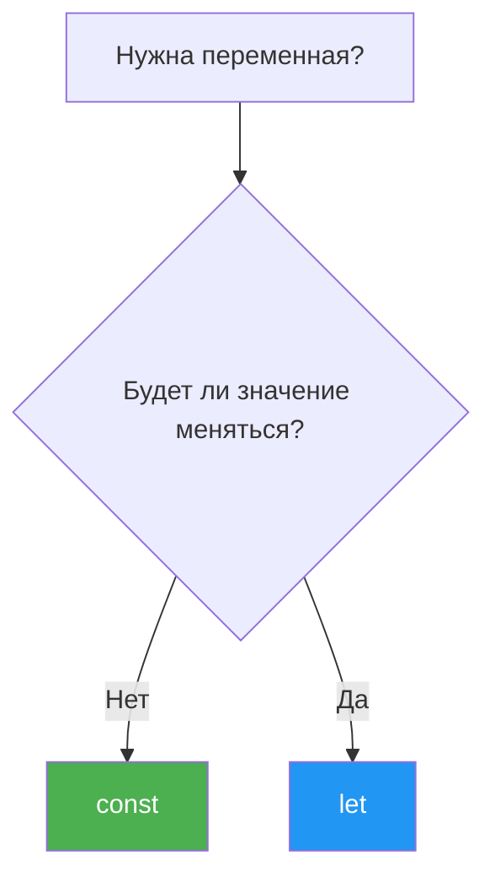
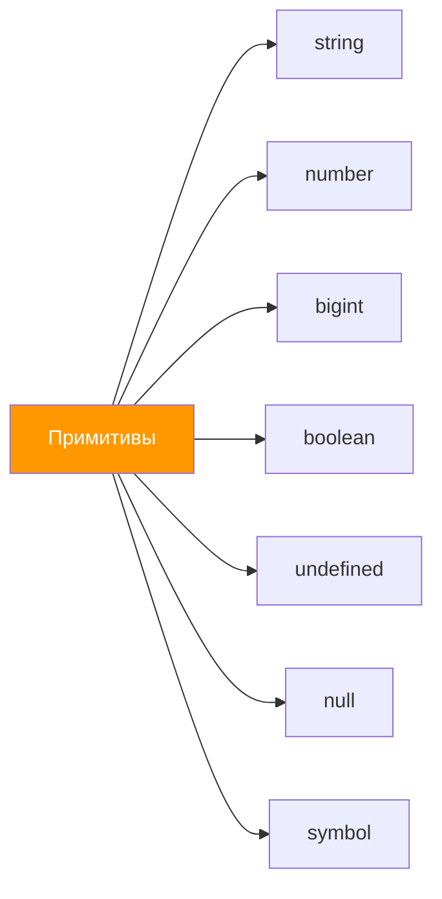

# Урок 1. Переменные и типы данных

## Что такое переменная?

Переменная — это **именованный контейнер** для хранения данных. Представь себе коробку с наклейкой: на наклейке — имя переменной, а внутри — значение.

```js
let name = "Анна"; // коробка с наклейкой "name", внутри — строка "Анна"
let age = 25;       // коробка с наклейкой "age", внутри — число 25
```

## Объявление переменных: let, const, var

В JavaScript есть три способа объявить переменную:

### `let` — переменная, значение которой можно менять

```js
let score = 0;
score = 10; // можно изменить
score = 20; // и ещё раз
```

### `const` — константа, значение нельзя переназначить

```js
const PI = 3.14159;
PI = 3; // Ошибка! Нельзя изменить const
```

Используй `const` по умолчанию. Переходи на `let`, только если значение действительно нужно менять.

### `var` — устаревший способ (не используй)

```js
var old = "устарело";
```

`var` работает иначе — у него нет блочной области видимости, что приводит к неожиданным ошибкам. В современном JavaScript всегда используй `let` и `const`.



## Правила именования

- Имя может содержать буквы, цифры, `_` и `$`
- Не может начинаться с цифры
- Нельзя использовать зарезервированные слова (`let`, `const`, `if`, `return`...)
- JavaScript чувствителен к регистру: `name` и `Name` — разные переменные

```js
// Хорошие имена
let userName = "Иван";
let itemCount = 42;
let isReady = true;

// Плохие имена
let x = "Иван";      // непонятно, что хранится
let a1 = 42;          // бессмысленное имя
// let 2name = "Ой";  // ошибка: начинается с цифры
```

Принято использовать **camelCase**: первое слово с маленькой буквы, каждое следующее — с большой (`firstName`, `totalPrice`, `isLoggedIn`).

## Типы данных

В JavaScript есть **8 типов данных**. Семь из них — примитивные, один — объектный.

### Примитивные типы



#### 1. `string` — строка

Текстовые данные. Можно задать тремя способами:

```js
let single = 'Одинарные кавычки';
let double = "Двойные кавычки";
let backticks = `Обратные кавычки (шаблонные литералы)`;
```

Шаблонные литералы (обратные кавычки) позволяют встраивать выражения:

```js
let name = "Мир";
let greeting = `Привет, ${name}!`; // "Привет, Мир!"

let a = 5;
let b = 3;
let result = `${a} + ${b} = ${a + b}`; // "5 + 3 = 8"
```

#### 2. `number` — число

Целые и дробные числа, а также специальные значения:

```js
let integer = 42;
let float = 3.14;
let negative = -10;

// Специальные значения
let inf = Infinity;       // бесконечность
let negInf = -Infinity;   // минус бесконечность
let notNum = NaN;          // "не число" (Not a Number)
```

`NaN` появляется при невалидных математических операциях:

```js
let result = "hello" * 2; // NaN
let check = NaN === NaN;  // false — NaN не равен даже самому себе!
```

#### 3. `bigint` — большие целые числа

Для чисел, которые не помещаются в обычный `number`:

```js
let big = 9007199254740991n; // добавляем "n" в конце
let another = BigInt("12345678901234567890");
```

#### 4. `boolean` — логический тип

Только два значения: `true` (истина) и `false` (ложь):

```js
let isOnline = true;
let isBlocked = false;

let isAdult = age >= 18; // результат сравнения — boolean
```

#### 5. `undefined` — значение не задано

Переменная объявлена, но значение не присвоено:

```js
let something;
console.log(something); // undefined
```

#### 6. `null` — намеренное отсутствие значения

Используется, когда нужно явно указать «пусто» или «ничего»:

```js
let user = null; // пользователь не найден
```

> **Разница между `null` и `undefined`:** `undefined` означает «переменная существует, но значение не задали», а `null` — «мы специально указали, что значение пустое».

#### 7. `symbol` — уникальный идентификатор

Используется редко, в основном для создания уникальных ключей объектов:

```js
let id = Symbol("id");
```

## Оператор `typeof`

Позволяет узнать тип значения:

```js
typeof "hello"    // "string"
typeof 42         // "number"
typeof true       // "boolean"
typeof undefined  // "undefined"
typeof null       // "object"  — это известный баг JavaScript!
typeof Symbol()   // "symbol"
typeof 10n        // "bigint"
```

> **Внимание:** `typeof null` возвращает `"object"` — это историческая ошибка в языке, которую уже не исправят.

## Преобразование типов

JavaScript может автоматически преобразовывать типы. Это называется **приведение типов** (type coercion).

### Явное преобразование

```js
// В строку
String(42);        // "42"
String(true);      // "true"
String(null);      // "null"

// В число
Number("42");      // 42
Number("hello");   // NaN
Number(true);      // 1
Number(false);     // 0
Number(null);      // 0
Number(undefined); // NaN

// В логическое значение
Boolean(1);        // true
Boolean(0);        // false
Boolean("hello");  // true
Boolean("");       // false
Boolean(null);     // false
Boolean(undefined);// false
```

### Неявное преобразование

```js
// Строка + число = строка (конкатенация)
"5" + 3     // "53"
"5" + true  // "5true"

// Другие операторы преобразуют в число
"5" - 3     // 2
"5" * 2     // 10
true + true // 2
```

## Итоги

| Концепция | Описание |
|-----------|----------|
| `let` | Переменная, значение можно менять |
| `const` | Константа, нельзя переназначить |
| `var` | Устаревший способ, не используй |
| `typeof` | Оператор для определения типа |
| Примитивы | string, number, bigint, boolean, undefined, null, symbol |
| Приведение типов | Автоматическое/ручное преобразование между типами |

---

Теперь переходи к [заданиям](./practice/index.js)!
