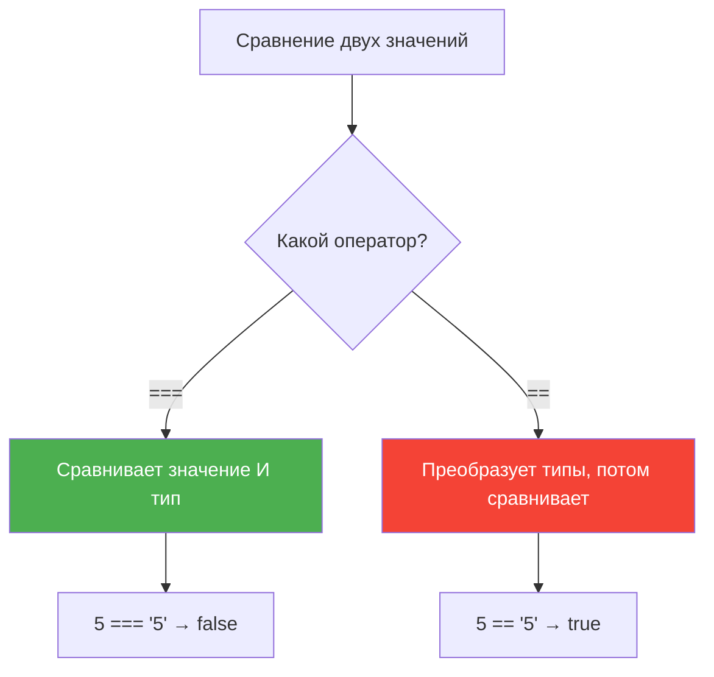
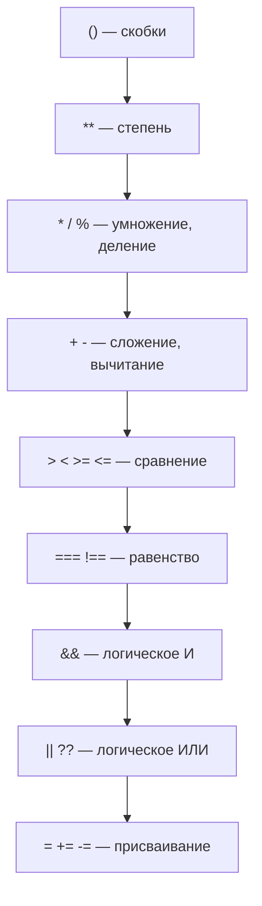

# Урок 2. Операторы

## Что такое оператор?

Оператор — это символ, который выполняет операцию над значениями. Например, `+` складывает числа, а `===` сравнивает.

```js
let result = 2 + 3; // + это оператор, 2 и 3 — операнды
```

## Арифметические операторы

Работают как обычная математика:

| Оператор | Описание | Пример | Результат |
|----------|----------|--------|-----------|
| `+` | Сложение | `5 + 3` | `8` |
| `-` | Вычитание | `5 - 3` | `2` |
| `*` | Умножение | `5 * 3` | `15` |
| `/` | Деление | `10 / 3` | `3.333...` |
| `%` | Остаток от деления | `10 % 3` | `1` |
| `**` | Возведение в степень | `2 ** 3` | `8` |

### Остаток от деления (`%`)

Очень полезный оператор. Возвращает остаток:

```js
10 % 3  // 1  (10 = 3*3 + 1)
10 % 2  // 0  (10 = 5*2 + 0) — чётное число!
7 % 2   // 1  — нечётное число!
```

Часто используется для проверки чётности:

```js
let isEven = number % 2 === 0; // true, если число чётное
```

### Возведение в степень (`**`)

```js
2 ** 3   // 8     (2 * 2 * 2)
3 ** 2   // 9     (3 * 3)
25 ** 0.5 // 5    (квадратный корень из 25)
```

## Операторы сравнения

Результат сравнения — всегда `boolean` (`true` или `false`).

| Оператор | Описание | Пример | Результат |
|----------|----------|--------|-----------|
| `===` | Строгое равенство | `5 === 5` | `true` |
| `!==` | Строгое неравенство | `5 !== "5"` | `true` |
| `==` | Нестрогое равенство | `5 == "5"` | `true` |
| `!=` | Нестрогое неравенство | `5 != "5"` | `false` |
| `>` | Больше | `5 > 3` | `true` |
| `<` | Меньше | `5 < 3` | `false` |
| `>=` | Больше или равно | `5 >= 5` | `true` |
| `<=` | Меньше или равно | `3 <= 5` | `true` |

### `===` vs `==` — строгое и нестрогое сравнение



**Всегда используй `===` и `!==`**, чтобы избежать неожиданных преобразований:

```js
0 == ""     // true  — что?!
0 == false  // true  — неожиданно
null == undefined // true — ещё сюрприз

0 === ""     // false — так надёжнее
0 === false  // false
null === undefined // false
```

## Логические операторы

Работают с логическими значениями:

| Оператор | Описание | Пример | Результат |
|----------|----------|--------|-----------|
| `&&` | И (AND) | `true && false` | `false` |
| `\|\|` | ИЛИ (OR) | `true \|\| false` | `true` |
| `!` | НЕ (NOT) | `!true` | `false` |
| `??` | Nullish coalescing | `null ?? "default"` | `"default"` |

### Оператор `&&` (И)

Возвращает `true`, только если **оба** операнда истинны:

```js
true && true   // true
true && false  // false
false && true  // false
false && false // false
```

Практический пример:

```js
let age = 25;
let hasTicket = true;
let canEnter = age >= 18 && hasTicket; // true
```

### Оператор `||` (ИЛИ)

Возвращает `true`, если **хотя бы один** операнд истинный:

```js
true || false  // true
false || true  // true
false || false // false
```

### Оператор `!` (НЕ)

Инвертирует значение:

```js
!true   // false
!false  // true
!0      // true  (0 — falsy)
!"hello" // false ("hello" — truthy)
```

### Оператор `??` (Nullish coalescing)

Возвращает правый операнд, если левый — `null` или `undefined`:

```js
let name = null ?? "Аноним";        // "Аноним"
let count = undefined ?? 0;          // 0
let score = 0 ?? 100;                // 0 (0 — не null/undefined!)
let text = "" ?? "по умолчанию";     // "" (пустая строка — не null/undefined!)
```

> **Отличие `??` от `||`:** Оператор `||` считает «ложными» значения `0`, `""`, `false`, `null`, `undefined`, `NaN`. А `??` реагирует только на `null` и `undefined`.

```js
0 || 10    // 10 — не то, что мы хотели!
0 ?? 10    // 0  — правильно, 0 это валидное значение
```

## Операторы присваивания

| Оператор | Пример | Эквивалент |
|----------|--------|------------|
| `=` | `x = 5` | — |
| `+=` | `x += 3` | `x = x + 3` |
| `-=` | `x -= 3` | `x = x - 3` |
| `*=` | `x *= 3` | `x = x * 3` |
| `/=` | `x /= 3` | `x = x / 3` |
| `%=` | `x %= 3` | `x = x % 3` |

```js
let score = 100;
score += 10;  // 110
score -= 20;  // 90
score *= 2;   // 180
```

### Инкремент и декремент

```js
let count = 5;
count++;  // 6 (count = count + 1)
count--;  // 5 (count = count - 1)
```

## Конкатенация строк

Оператор `+` со строками выполняет **конкатенацию** (склеивание):

```js
"Привет" + " " + "мир"  // "Привет мир"
"Возраст: " + 25         // "Возраст: 25" — число → строка
```

Лучше использовать **шаблонные литералы** вместо конкатенации:

```js
let name = "Анна";
let age = 25;

// Конкатенация (старый способ)
let msg1 = "Имя: " + name + ", возраст: " + age;

// Шаблонный литерал (современный способ)
let msg2 = `Имя: ${name}, возраст: ${age}`;
```

## Приоритет операторов

Операторы выполняются в определённом порядке, как в математике:



Если сомневаешься — используй скобки:

```js
let result = (2 + 3) * 4; // 20, а не 14
```

## Итоги

| Категория | Операторы |
|-----------|-----------|
| Арифметические | `+`, `-`, `*`, `/`, `%`, `**` |
| Сравнения | `===`, `!==`, `>`, `<`, `>=`, `<=` |
| Логические | `&&`, `\|\|`, `!`, `??` |
| Присваивания | `=`, `+=`, `-=`, `*=`, `/=` |

---

Теперь переходи к [заданиям](./practice/index.js)!
