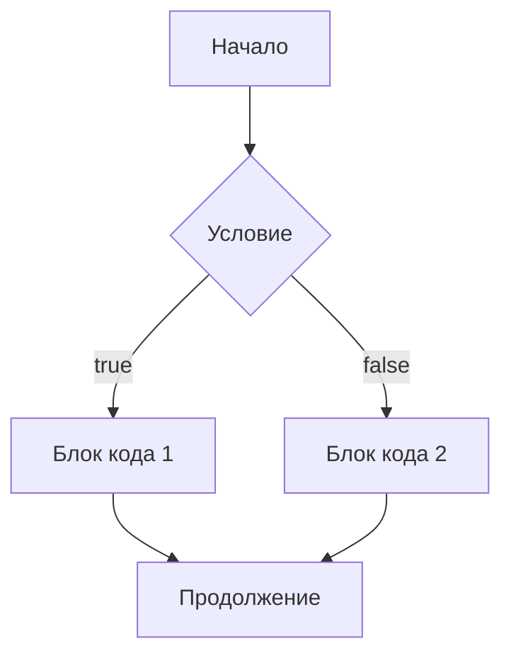
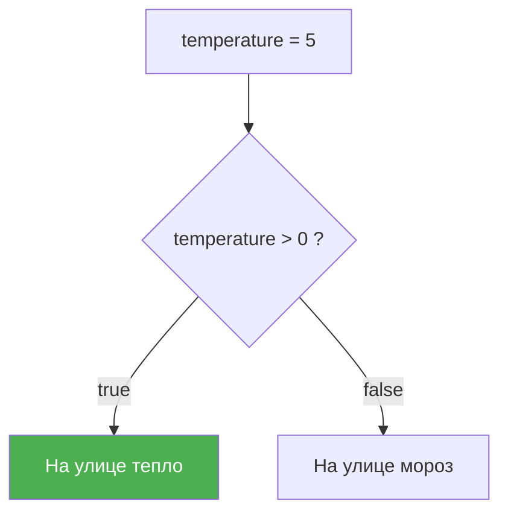
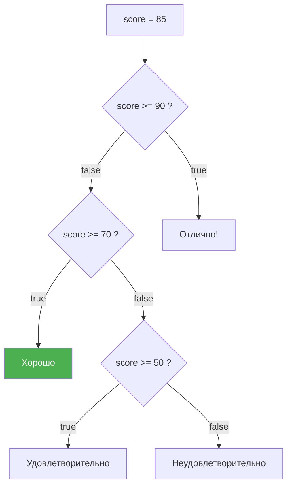

# Урок 3. Условия

## Зачем нужны условия?

Условия позволяют программе принимать решения. В зависимости от ситуации выполняется тот или иной блок кода.



## Конструкция `if`

Самая простая форма — выполнить код, если условие истинно:

```js
let age = 20;

if (age >= 18) {
  console.log("Доступ разрешён");
}
```

Код внутри фигурных скобок `{}` выполнится, только если выражение в круглых скобках `()` — `true`.

## Конструкция `if...else`

Добавляем альтернативу — что делать, если условие ложно:

```js
let temperature = 5;

if (temperature > 0) {
  console.log("На улице тепло");
} else {
  console.log("На улице мороз");
}
```



## Цепочка `else if`

Когда нужно проверить несколько условий:

```js
let score = 85;

if (score >= 90) {
  console.log("Отлично!");
} else if (score >= 70) {
  console.log("Хорошо");
} else if (score >= 50) {
  console.log("Удовлетворительно");
} else {
  console.log("Неудовлетворительно");
}
// Выведет: "Хорошо"
```

Условия проверяются **сверху вниз**. Как только одно из них `true`, остальные пропускаются:



## Тернарный оператор `? :`

Краткая форма `if...else` для простых случаев:

```js
// Синтаксис: условие ? значениеЕслиTrue : значениеЕслиFalse

let age = 20;
let status = age >= 18 ? "взрослый" : "ребёнок";
// status = "взрослый"

let price = 100;
let text = price === 0 ? "Бесплатно" : `${price} ₽`;
// text = "100 ₽"
```

> Используй тернарный оператор только для простых выражений. Если логика сложная — лучше обычный `if...else`.

## Конструкция `switch`

Удобна, когда нужно сравнить одно значение с множеством вариантов:

```js
let day = 3;

switch (day) {
  case 1:
    console.log("Понедельник");
    break;
  case 2:
    console.log("Вторник");
    break;
  case 3:
    console.log("Среда");
    break;
  case 4:
    console.log("Четверг");
    break;
  case 5:
    console.log("Пятница");
    break;
  default:
    console.log("Выходной");
}
// Выведет: "Среда"
```

### Важно: не забывай `break`!

Без `break` выполнение «провалится» в следующий `case`:

```js
let fruit = "яблоко";

switch (fruit) {
  case "яблоко":
    console.log("Это яблоко");
    // забыли break!
  case "банан":
    console.log("Это банан");
    break;
}
// Выведет ОБА: "Это яблоко" и "Это банан"
```

### Группировка `case`

Иногда полезно объединить несколько вариантов:

```js
let month = 3;

switch (month) {
  case 12:
  case 1:
  case 2:
    console.log("Зима");
    break;
  case 3:
  case 4:
  case 5:
    console.log("Весна");
    break;
  case 6:
  case 7:
  case 8:
    console.log("Лето");
    break;
  case 9:
  case 10:
  case 11:
    console.log("Осень");
    break;
  default:
    console.log("Неверный месяц");
}
```

## Truthy и Falsy значения

В JavaScript любое значение можно использовать как условие. Значения делятся на **truthy** (истинные) и **falsy** (ложные).

### Falsy-значения (их всего 8):

```js
false
0
-0
0n          // BigInt ноль
""          // пустая строка
null
undefined
NaN
```

**Всё остальное — truthy**, включая:

```js
"0"         // непустая строка — truthy!
" "         // строка с пробелом — truthy!
[]          // пустой массив — truthy!
{}          // пустой объект — truthy!
```

### Применение:

```js
let name = "";

if (name) {
  console.log(`Привет, ${name}!`);
} else {
  console.log("Имя не указано"); // сюда попадём, т.к. "" — falsy
}
```

```js
let user = null;

if (user) {
  console.log(user.name); // не выполнится, т.к. null — falsy
}
```

## Опциональная цепочка `?.`

Безопасный доступ к свойствам, которые могут не существовать:

```js
let user = null;

// Без ?. — будет ошибка:
// console.log(user.name); // TypeError!

// С ?. — безопасно:
console.log(user?.name); // undefined (без ошибки)
```

Работает и с вложенными свойствами:

```js
let order = {
  customer: {
    name: "Иван",
  },
};

console.log(order?.customer?.name);    // "Иван"
console.log(order?.delivery?.address); // undefined (нет ошибки)
```

## Комбинирование условий

Логические операторы позволяют строить сложные условия:

```js
let age = 25;
let hasTicket = true;
let isVIP = false;

// И — оба условия должны быть true
if (age >= 18 && hasTicket) {
  console.log("Проходите");
}

// ИЛИ — хотя бы одно true
if (hasTicket || isVIP) {
  console.log("У вас есть доступ");
}

// НЕ — инвертирует
if (!isVIP) {
  console.log("Вы не VIP");
}

// Комбинация
if (age >= 18 && (hasTicket || isVIP)) {
  console.log("Добро пожаловать!");
}
```

## Итоги

| Конструкция | Когда использовать |
|-------------|-------------------|
| `if...else` | Одно-два условия |
| `else if` | Цепочка из нескольких условий |
| `switch` | Сравнение одного значения с множеством вариантов |
| `? :` | Простое условие в одну строку |
| `?.` | Безопасный доступ к свойствам |

---

Теперь переходи к [заданиям](./practice/index.js)!
